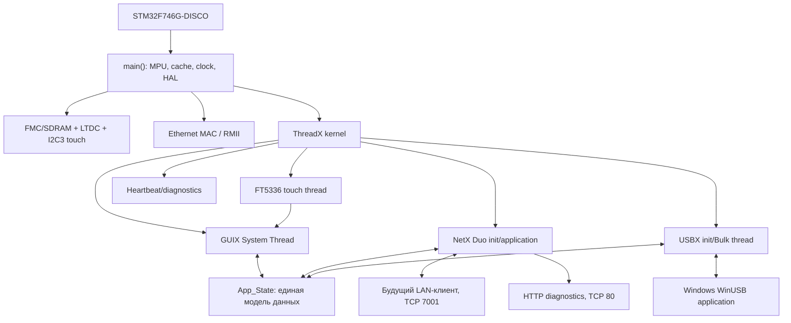
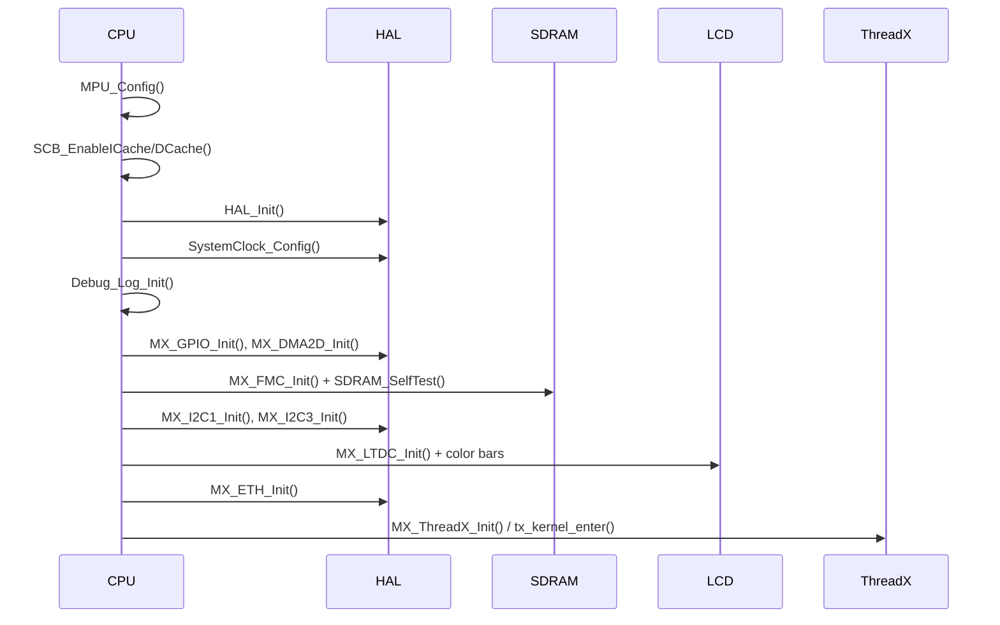
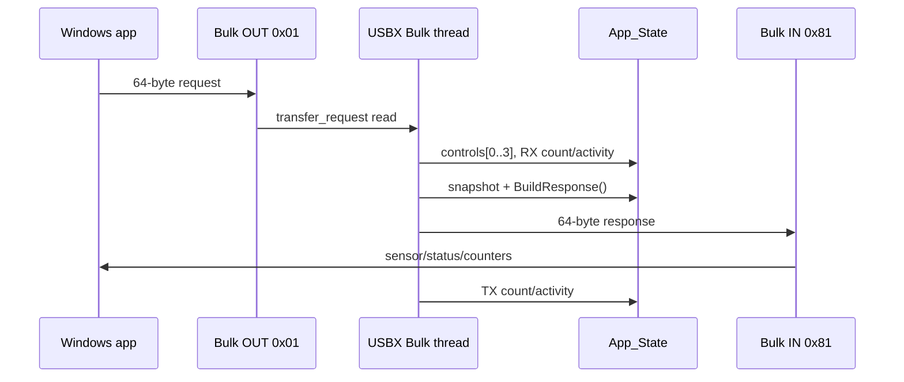

# Техническая документация проекта STM32F746G-DISCO / Azure RTOS / GUIX / USBX / NetX Duo

Версия документа: 1.0  
Дата аудита исходников: 19 июля 2026 года  
Целевая плата: **STM32F746G-DISCO**  
Микроконтроллер: **STM32F746NGH6**, Arm Cortex-M7, 216 МГц  
Встроенное приложение: `C:\DATA\project\F746_USB`  
Windows-приложение: `C:\DATA\project\RTOS_TEST_GUI_TEST\generic_hid_cs_v62`

> Документ составлен по фактическим исходникам и настройкам проекта, а не только по `.ioc`. Если исходники и CubeMX-настройки расходятся, ниже описано реально выполняющееся поведение программы. Для повторного распространения компонентов Azure RTOS необходимо сверяться с файлами `LICENSE` в используемых пакетах.

## Содержание

1. Назначение проекта
2. Общая архитектура
3. Состав исходников
4. Полная последовательность запуска STM32
5. Тактирование
6. Карта памяти, MPU и кеширование
7. ThreadX: потоки, приоритеты и ресурсы
8. Аппаратная периферия
9. Графический стек GUIX
10. Единая модель состояния приложения
11. Единый прикладной пакет 64 байта
12. USB Device / USBX / WinUSB
13. Ethernet и NetX Duo
14. Диагностика памяти и выполнения
15. Windows-приложение WinUSB
16. Основные функции по подсистемам
17. Сборка и прошивка
18. Проверка после сборки
19. Диагностика типовых неисправностей
20. Изменение проекта и регенерация CubeMX
21. Текущие ограничения и направления развития
22. Практическая памятка оператора
23. Связь с прежним F4-проектом
24. Итог

## 1. Назначение проекта

Проект реализует единое устройство управления и мониторинга на STM32F746G-DISCO со следующими подсистемами:

- графический интерфейс 480×272 на встроенном LCD, построенный на GUIX;
- сенсорное управление через контроллер FT5336;
- ThreadX как операционная система реального времени;
- USB Device с пользовательским классом Bulk на USBX;
- автоматическое подключение к Windows через стандартный драйвер WinUSB;
- Ethernet RMII с NetX Duo, DHCP и пользовательским TCP-сервером;
- диагностический HTTP-сервер;
- единая модель состояния для USB, LAN, GUI и датчика BME280;
- защита экрана после минуты бездействия;
- диагностика памяти, потоков, стеков и пулов ThreadX через UART, GUI и браузер.

Приложение спроектировано так, чтобы отсутствие USB-кабеля, Ethernet-кабеля или физического датчика не блокировало запуск графики и остальных подсистем. GUI запускается до сетевого и USB-стеков, а их тяжёлая инициализация выполняется отдельными потоками уже после запуска планировщика.

### 1.1. Версии основных компонентов

| Компонент | Версия в проверенном проекте |
|---|---|
| STM32CubeF7 HAL/CMSIS package | 1.17.4 |
| X-CUBE-AZRTOS-F7 integration | 1.1.0 |
| ThreadX | 6.1.10 |
| GUIX | 6.1.10 |
| USBX | 6.1.10 |
| NetX Duo | 6.1.10 |
| STM32CubeIDE | 2.2.0 |
| Windows target framework | .NET Framework 4.5 |

## 2. Общая архитектура



Основной принцип обмена данными: драйверы связи не обращаются напрямую к виджетам GUIX. USBX и NetX Duo обновляют общую структуру `App_State`; GUI периодически получает её атомарный снимок и меняет только те элементы экрана, чьё содержимое действительно изменилось.

## 3. Состав исходников

### 3.1. Встроенное приложение STM32

Ключевые каталоги и файлы:

| Путь | Назначение |
|---|---|
| `Core/Src/main.c` | Самый ранний запуск, MPU, кеши, HAL, тактирование и периферия до ThreadX |
| `Core/Src/app_threadx.c` | Создание пулов ThreadX, основных и отложенных потоков |
| `Core/Src/app_guix.c` | Полная программная сборка интерфейса GUIX, дисплейный драйвер, touch и screensaver |
| `Core/Src/app_state.c` | Единая потокобезопасная модель состояния, счётчики и пакет длиной 64 байта |
| `Core/Src/app_usbx_device.c` | USBX Device, дескрипторы, WinUSB, Bulk-класс и hot-plug |
| `Core/Src/app_netxduo.c` | NetX Duo, DHCP, TCP 7001, HTTP 80 и обработка link up/down |
| `Core/Src/app_diagnostics.c` | Снимки памяти, пулов, стеков и потоков |
| `Core/Inc/app_diagnostics_config.h` | Единые compile-time переключатели диагностики |
| `Core/Src/debug_log.c` | Диагностический USART6 без зависимости от сгенерированного HAL UART-драйвера |
| `Core/Src/stm32f7xx_hal_msp.c` | MSP-настройка GPIO/clock/NVIC периферии |
| `Core/Src/stm32f7xx_it.c` | Обработчики прерываний и расширенный вывод fault-регистров |
| `Core/Src/fmc.c`, `Core/Src/ltdc.c`, `Core/Src/i2c.c`, `Core/Src/eth.c`, `Core/Src/dma2d.c` | Низкоуровневая инициализация периферии |
| `STM32F746NGHX_FLASH.ld` | Активная карта Flash, внутренней RAM, Ethernet RAM и внешней SDRAM |
| `F746_USB.ioc` | Исходная конфигурация STM32CubeMX |
| `Middlewares/ST/...` | ThreadX, GUIX, USBX и NetX Duo 6.1.10 |

В каталоге `memory` есть более старый вариант linker script. При сборке используется корневой `STM32F746NGHX_FLASH.ld`; редактирование неактивного файла на размещение данных не влияет.

### 3.2. Windows-приложение

| Файл/класс | Назначение |
|---|---|
| `FrmMain.cs` | Реальная точка запуска и основная форма |
| `FrmMain.Designer.cs` | Размещение элементов главного окна |
| `WinUsbDevice.cs` | Открытие WinUSB, поиск Bulk endpoint, чтение и запись |
| `UsbInterfaceDiscovery.cs` | Поиск интерфейсного GUID и device path в Windows |
| `DeviceManagement.cs` | SetupAPI и уведомления Windows об устройствах |
| `MonitorForm.cs` | Окно сырых TX/RX-пакетов, событий и ручного поиска |
| `Hid.cs` и другие старые HID-файлы | Наследие исходного HID-примера; в рабочем Bulk-обмене не используются |
| `GenericHid.csproj` | .NET Framework 4.5, выбранный Startup Object и состав сборки |

Название каталога и часть имён классов сохранились от старого проекта Generic HID. Фактический рабочий транспорт теперь **WinUSB Bulk**, а не HID.

## 4. Полная последовательность запуска STM32

### 4.1. До входа в `main()`

После аппаратного сброса выполняется стандартный startup-файл Cortex-M7:

1. Загружается начальный указатель стека.
2. Выполняется `Reset_Handler`.
3. Копируется секция `.data` из Flash во внутреннюю RAM.
4. Обнуляется `.bss`.
5. Выполняется системная инициализация CMSIS.
6. Управление передаётся функции `main()`.

Секции `NOLOAD` во внешней SDRAM загрузчик из Flash не копирует. Их содержимое становится пригодным только после настройки FMC; программа явно заполняет нужные области при создании GUIX и пулов ThreadX.

### 4.2. Порядок вызовов в `main()`



Фактическая цепочка:

1. `MPU_Config()` задаёт атрибуты памяти до включения кешей.
2. `SCB_EnableICache()` включает instruction cache.
3. `SCB_EnableDCache()` включает data cache.
4. `HAL_Init()` сбрасывает HAL-периферию, настраивает NVIC grouping и HAL tick.
5. `SystemClock_Config()` переводит ядро на 216 МГц и создаёт 48 МГц для USB.
6. `Debug_Log_Init()` напрямую включает USART6 и печатает заголовок загрузки.
7. `MX_GPIO_Init()` задаёт начальные состояния LCD enable/backlight и общие GPIO.
8. `MX_DMA2D_Init()` подготавливает 2D-ускоритель.
9. `MX_FMC_Init()` поднимает внешнюю SDRAM.
10. `SDRAM_SelfTest()` проверяет тестовый участок памяти несколькими шаблонами и очищает его.
11. `MX_I2C1_Init()` включает отдельную Arduino-шину BME280 на PB8/PB9.
12. `MX_I2C3_Init()` включает шину сенсорного контроллера FT5336.
13. `MX_LTDC_Init()` настраивает LCD timing, слой и RGB-интерфейс.
14. На framebuffer выводятся цветные полосы и удерживаются две секунды. Это аппаратный тест LCD, SDRAM и LTDC до RTOS/GUIX.
15. `MX_ETH_Init()` конфигурирует Ethernet MAC, но ещё не запускает NetX Duo.
16. `MX_ThreadX_Init()` вызывает `tx_kernel_enter()`; обычный возврат из неё не ожидается.

Стадия каждого шага записывается в `Debug_BootStage`. Если произойдёт fault, обработчик сможет показать последний успешно начатый этап.

### 4.3. Вход в ThreadX

ThreadX вызывает `tx_application_define()`. В этой функции:

1. Во внешней SDRAM создаются три независимых byte pool:
   - ThreadX application pool — 32 КиБ;
   - NetX pool — 96 КиБ;
   - USBX pool — 32 КиБ.
2. Вызывается `App_ThreadX_Init()`:
   - обнуляется и инициализируется `App_State`;
   - создаётся поток BME280;
   - создаётся heartbeat/diagnostics thread;
   - запускается полная инициализация GUIX.
3. Создаётся отдельный поток отложенного запуска NetX Duo.
4. Создаётся отдельный поток отложенного запуска USBX Device.
5. `tx_application_define()` завершается, и ThreadX передаёт процессор готовым потокам.

Разделение важно: GUI доступен даже без сетевого кабеля и USB. Ожидание DHCP или USB host не удерживает загрузку экрана.

## 5. Тактирование

### 5.1. Основное дерево частот

Внешний HSE имеет частоту 25 МГц. Main PLL настроен так:

| Параметр | Значение | Результат |
|---|---:|---:|
| PLLM | 25 | вход VCO 1 МГц |
| PLLN | 432 | VCO 432 МГц |
| PLLP | 2 | SYSCLK 216 МГц |
| PLLQ | 9 | USB clock 48 МГц |

Итоговые частоты:

- Cortex-M7 / SYSCLK: 216 МГц;
- AHB / HCLK: 216 МГц;
- APB1 / PCLK1: 54 МГц;
- таймеры APB1: 108 МГц;
- APB2 / PCLK2: 108 МГц;
- таймеры APB2: 216 МГц;
- USB FS: 48 МГц.

Для 216 МГц включается OverDrive. Flash latency равна 7 wait states.

### 5.2. Pixel clock LCD

PLLSAI настроен на N=192, R=5 с дополнительным делителем 4. Получается LTDC pixel clock **9,6 МГц**, согласованный с timing встроенного дисплея 480×272.

### 5.3. HAL tick и ThreadX tick

HAL tick формируется TIM6:

- исходная частота таймера 108 МГц;
- prescaler переводит счётчик на 1 МГц;
- period 999 даёт период 1 мс;
- приоритет IRQ — 15, то есть самый низкий из используемых.

ThreadX работает с частотой системного тика 100 Гц: один RTOS tick равен 10 мс. Поэтому задержка `tx_thread_sleep(2)` соответствует примерно 20 мс, а не двум миллисекундам.

## 6. Карта памяти, MPU и кеширование

### 6.1. Области памяти linker script

| Область | Начало | Размер | Использование |
|---|---:|---:|---|
| Flash | `0x08000000` | 1 МиБ | Код, константы, исходный образ `.data` |
| DTCMRAM | `0x20000000` | 64 КиБ | Main/exception stack и минимальная проверочная область C heap/stack |
| AXI SRAM | `0x20010000` | 192 КиБ | `.data`, `.bss`, обычные глобальные объекты |
| ETH_RAM | `0x20040000` | 64 КиБ | Ethernet DMA descriptors и DMA-доступные области |
| SDRAM framebuffer | `0xC0000000` | 512 КиБ | Два RGB565 framebuffer 480×272 |
| SDRAM application | `0xC0080000` | 7,5 МиБ | Статические backing areas byte pools ThreadX/NetX/USBX и резерв расширения |

Два кадра RGB565 занимают:

`480 × 272 × 2 байта × 2 буфера = 522 240 байт`.

Это на 2 048 байт меньше отведённых 512 КиБ и полностью помещается в framebuffer region.

### 6.2. Фактическое использование памяти текущей сборкой

Для проверенной Debug-сборки:

- `.text`: 334 276 байт;
- `.data`: 2 704 байта;
- `.bss`: 727 476 байт, однако эта цифра ELF суммирует также `NOLOAD` во внешней SDRAM;
- внутренняя `.bss`: около 39 540 байт;
- внутренняя `.data + .bss`: около 42 244 байт;
- два framebuffer: 522 240 байт;
- backing area трёх byte pool: 163 840 байт;
- Ethernet RX descriptors: 160 байт;
- Ethernet TX descriptors: 160 байт.

Приблизительное занятие Flash — `text + data = 336 980` байт, то есть около 32,1% от 1 МиБ. В диагностической вкладке применяются linker symbols, поэтому она показывает внутреннюю RAM и внешнюю SDRAM раздельно и точнее общей строки `bss` из утилиты `size`.

### 6.3. MPU

MPU используется обязательно и настраивается до включения D-cache:

| Region | Адрес/размер | Атрибуты | Причина |
|---|---|---|---|
| 0 | `0xC0000000`, 8 МиБ | Full access, executable disabled, cacheable, bufferable | Базовые свойства всей SDRAM |
| 1 | `0xC0000000`, 512 КиБ | Shareable, non-cacheable, non-bufferable, XN | LTDC читает framebuffer напрямую; исключается показ устаревших cache lines |
| 2 | `0x20040000`, 64 КиБ | Shareable, non-cacheable, non-bufferable, XN | Ethernet DMA descriptors должны быть когерентны с MAC DMA |

Region с более высоким номером перекрывает базовый SDRAM region. Поэтому framebuffer некешируемый, а остальная внешняя SDRAM остаётся кешируемой и быстрее подходит для RTOS-пулов.

Без этой настройки вероятны трудно воспроизводимые дефекты: разрывы или старое содержимое LCD, зависание Ethernet DMA, повреждение descriptor ownership и пропущенные пакеты.

## 7. ThreadX: потоки, приоритеты и ресурсы

В ThreadX меньшее число означает более высокий приоритет.

| Поток | Приоритет | Стек | Timeslice | Назначение |
|---|---:|---:|---:|---|
| NetX DHCP Client | 3 | 4096 | библиотечный | DHCP state machine |
| NetX IP helper | 5 | 4096 | нет | Внутренняя обработка IP/TCP/UDP/ARP |
| NetX application | 8 | 4096 | нет | Link service и TCP-сервер 7001 |
| USBX Bulk | 10 | 2048 | 2 ticks | Цикл OUT 64 байта → IN 64 байта |
| GUIX System Thread | 12 | 4096 | 2 ticks | События, timers, рисование и dirty rectangles |
| FT5336 touch | 13 | 2048 | 2 ticks | Опрос touch через I2C3 и генерация GUIX events |
| Diagnostics HTTP | 16 | 4096 | нет | TCP port 80, если web diagnostics включена |
| BME280 sensor | 18 | 2048 | нет | Поиск датчика, forced measurement и обновление `App_State` |
| NetX init | 20 | 4096 | 5 ticks | Однократная инициализация после старта scheduler |
| USBX init | 20 | 4096 | 5 ticks | Однократная инициализация после старта scheduler |
| Debug heartbeat | 30 | 2048 или 1024 | нет | Сервис USB hot-plug и периодическая диагностика |

После завершения инициализации NetX/USBX соответствующие init-потоки больше не выполняют полезную работу. Кроме перечисленного, ThreadX и middleware создают внутренние system/timer objects; они также могут быть показаны в диагностической таблице.

### 7.1. Защита стеков

Если включён главный diagnostic define:

- включается `TX_ENABLE_STACK_CHECKING`;
- стек заполняется контрольным шаблоном;
- функция анализа определяет high-water mark;
- UART, GUI и web могут показать свободную и общую часть каждого стека.

Stack checking полезен при разработке, но его можно полностью исключить из production-сборки master-переключателем.

### 7.2. Приоритеты NVIC

Используется priority grouping 4:

- Ethernet IRQ — 6;
- USB OTG FS IRQ — 6;
- LTDC IRQ — 7;
- DMA2D IRQ — 7;
- TIM6 HAL tick IRQ — 15.

ISR не выполняют долгую обработку протокола. Они передают события/данные HAL и middleware, а основная логика исполняется потоками.

## 8. Аппаратная периферия

### 8.1. Сводная матрица интерфейсов

| Подсистема | MCU peripheral/interface | Состояние |
|---|---|---|
| LCD pixel output | LTDC RGB | Используется |
| Framebuffer memory | FMC SDRAM | Используется |
| Touch controller | I2C3 / FT5336 | Используется |
| Graphics accelerator | DMA2D | Инициализирован, текущим GUIX render path не используется |
| PC data connection | USB OTG FS Device / USBX Bulk | Используется |
| Network | Ethernet MAC RMII / LAN8742 / NetX Duo | Используется |
| Debug console | USART6 TX/RX, direct-register | Используется |
| HAL time base | TIM6 | Используется |
| BME280 | I2C1, PB8/PB9, Arduino D15/D14 | Используется; адрес 0x76/0x77, chip ID 0x60 |
| USB OTG HS | — | Не используется |
| USB host 5 V switch PD5 | GPIO/U16 | Не используется в Device mode |
| SDMMC, camera, audio, QSPI | — | Не задействованы прикладной программой |

### 8.2. GPIO управления дисплеем

| Сигнал | Пин | Назначение |
|---|---|---|
| LCD_DISP | PI12 | Аппаратное разрешение панели |
| LCD_BL_CTRL | PK3 | Подсветка LCD |

При GPIO init оба выхода сначала находятся в безопасном состоянии. После создания GUIX display/canvas приложение включает панель и подсветку.

### 8.3. Внешняя SDRAM через FMC

Настройки контроллера:

- SDRAM bank 1;
- 8 бит column address;
- 12 бит row address;
- 16-битная шина данных;
- 4 внутренних банка;
- CAS latency 2;
- SDRAM clock HCLK/2 = 108 МГц;
- read burst включён;
- read pipe delay 0;
- write protection выключена.

Timing:

| Параметр | Циклы памяти |
|---|---:|
| Load-to-active | 2 |
| Exit self-refresh | 8 |
| Self-refresh | 5 |
| Row cycle | 7 |
| Write recovery | 3 |
| Row precharge | 2 |
| Row-to-column | 2 |

Последовательность запуска SDRAM:

1. Clock enable command.
2. Пауза не менее 1 мс.
3. Precharge all.
4. Восемь auto-refresh cycles.
5. Запись mode register: burst length 1, sequential, CAS 2, standard mode, single write burst.
6. Установка refresh counter `0x0603`.

Самотест использует участок около `0xC007F000`, записывает и читает несколько шаблонов в 64 словах, после чего очищает тестовые данные. Ошибка выводится по USART до входа в GUIX.

### 8.4. LTDC

Параметры панели:

- логический размер: 480×272;
- формат пикселя: RGB565, 16 бит;
- framebuffer: `0xC0000000`;
- global alpha: 255;
- HSYNC: 40;
- VSYNC: 9;
- accumulated horizontal back porch: 53;
- accumulated vertical back porch: 11;
- accumulated active width: 533;
- accumulated active height: 283;
- total width: 565;
- total height: 285;
- HSYNC, VSYNC и DE active low;
- pixel clock inverted.

#### LTDC RGB pins

| Цвет | Пины |
|---|---|
| B0…B7 | PE4, PJ13, PJ14, PJ15, PG12, PK4, PK5, PK6 |
| G0…G7 | PJ7, PJ8, PJ9, PJ10, PJ11, PK0, PK1, PK2 |
| R0…R7 | PI15, PJ0, PJ1, PJ2, PJ3, PJ4, PJ5, PJ6 |
| HSYNC | PI10 |
| VSYNC | PI9 |
| DE | PK7 |
| CLK | PI14 |

Хотя физически разведено по восемь линий каждого цвета, слой настроен в RGB565, и LTDC формирует вывод из 16-битных пикселей.

### 8.5. DMA2D

DMA2D инициализирован в режиме memory-to-memory ARGB8888; foreground layer также задан ARGB8888. IRQ имеет приоритет 7.

В текущем варианте GUIX применяется программный драйвер RGB565 и функция display toggle с LTDC. В обычном пути отрисовки GUIX не вызывает DMA2D. Поэтому периферия подготовлена для будущего ускорения fill/blit/color conversion, но сейчас не является причиной или обязательной частью изображения.

### 8.6. I2C1 и BME280

I2C1 выделен только для внешнего BME280 на Arduino-разъёме:

- PB8 / Arduino D15 — I2C1_SCL;
- PB9 / Arduino D14 — I2C1_SDA;
- alternate function 4;
- open-drain с включёнными слабыми внутренними pull-up;
- внешние pull-up модуля к 3,3 В остаются рекомендуемыми;
- timing register `0x20404768`, standard mode;
- clock source PCLK1 = 54 МГц;
- аналоговый filter включён, digital filter 0.

Драйвер хранит адрес в корректной 7-битной форме и только перед HAL сдвигает его влево. Проверяются оба адреса `0x76` и `0x77`; принимается только chip ID `0x60` из регистра `0xD0`. Значение `0x58` означает BMP280 и намеренно отклоняется, потому что текущий пакет ожидает также влажность.

### 8.7. I2C3 и touch

I2C3 используется контроллером FT5336:

- PH7 — I2C3_SCL;
- PH8 — I2C3_SDA;
- alternate function 4;
- open-drain;
- без внутренних pull-up, так как они присутствуют на плате;
- timing register `0x20404768`;
- 7-битная адресация;
- analog filter включён;
- digital filter равен 0;
- clock source — PCLK1.

FT5336 имеет 7-битный адрес `0x38`; HAL получает его в сдвинутом виде `0x70`.

### 8.8. Ethernet RMII

| RMII-сигнал | Пин |
|---|---|
| REF_CLK | PA1 |
| MDIO | PA2 |
| CRS_DV | PA7 |
| MDC | PC1 |
| RXD0 | PC4 |
| RXD1 | PC5 |
| TX_EN | PG11 |
| TXD0 | PG13 |
| TXD1 | PG14 |

PHY — LAN8742. Ethernet MAC использует checksum offload и автоматические CRC/padding. Размер RX buffer — 1536 байт. MAC-адрес строится из UID микроконтроллера и начинается с `02`, то есть является locally administered unicast address.

Ethernet descriptor arrays размещены в отдельной некешируемой области. Для самих TX/RX buffers драйвер выполняет необходимые cache clean/invalidate операции.

### 8.9. Диагностический USART6

USART6 не включён как обычный сгенерированный CubeMX peripheral. `debug_log.c` настраивает его напрямую через регистры:

- PC6 — TX, Arduino D1;
- PC7 — RX;
- 115200 baud;
- 8 data bits, no parity, 1 stop bit;
- PCLK2 = 108 МГц.

Это объясняет, почему диагностика собирается и работает без файлов `usart.c/usart.h`. Вывод является polling и предназначен для диагностики, а не высокоскоростного протокола.

### 8.10. Fault handlers

Обработчики HardFault, MemManage, BusFault и UsageFault выводят:

- последний boot stage;
- CFSR;
- HFSR;
- DFSR;
- MMFAR;
- BFAR;
- AFSR.

После вывода MCU остаётся в бесконечном цикле, чтобы причина не потерялась из-за автоматического перезапуска. Для полевого продукта можно дополнительно сохранять эти поля в backup SRAM и выполнять watchdog reset.

## 9. Графический стек GUIX

### 9.1. Уровни графической подсистемы

Графика состоит из четырёх уровней:

1. **FMC/SDRAM** хранит два полных кадра.
2. **LTDC** непрерывно читает активный framebuffer и формирует RGB/timing для панели.
3. **GUIX display driver** рисует виджеты в скрытом буфере и переключает LTDC на готовый кадр.
4. **Application UI** создаёт окна, вкладки, prompts, sliders, buttons, timers и screensaver.

GUIX Studio в текущем проекте не используется. Интерфейс полностью создаётся C-кодом в `app_guix.c`; автоматически сгенерированных Studio screen/resource files нет.

### 9.2. Compile-time GUIX configuration

Основные значения из `gx_user.h`:

| Настройка | Значение | Смысл |
|---|---:|---|
| GUIX system stack | 4096 байт | Стек системного GUIX-потока |
| System thread priority | 12 | Ниже USB Bulk и сети, выше touch |
| System time slice | 2 ticks | Квант при равном приоритете |
| GUIX system timer | 20 мс | Базовый период GUIX timer events |
| Max queue events | 32 | Вместимость очереди событий |
| Max dirty areas | 32 | Число одновременно отслеживаемых изменённых прямоугольников |
| Max context nesting | 4 | Глубина вложенных draw contexts |
| UTF-8 | выключен | Текущие подписи сделаны ASCII |

### 9.3. Инициализация GUIX по функциям

Инициализация выполняется из `App_ThreadX_Init()` и проходит следующие стадии:

1. `gx_system_initialize()` создаёт внутреннее состояние GUIX.
2. `gx_display_create()` регистрирует дисплей `LTDC RGB565` размером 480×272 и callback настройки драйвера.
3. Display setup подключает стандартные software routines `_gx_display_driver_565rgb_setup()` и пользовательский `display_toggle()`.
4. Регистрируются таблицы colors, fonts и pixelmaps приложения.
5. `gx_canvas_create()` создаёт canvas и изначально связывает его со вторым framebuffer.
6. `create_interface()` создаёт root window, tab buttons, четыре page window и все дочерние widgets.
7. Root window и canvas показываются.
8. Запускается root timer для обновления данных.
9. Создаётся отдельный FT5336 touch thread.
10. Включаются LCD DISP и подсветка.
11. `gx_system_start()` запускает GUIX processing. Успешный код возврата — 0.

В UART эта цепочка видна сообщениями `system initialized`, `display created`, `canvas created`, `widgets created`, `touch thread created`.

### 9.4. Двойная буферизация

Используются два массива:

```c
uint16_t framebuffer[2][480 * 272];
```

Оба массива выровнены по 32 байтам и linker script размещает их в секции внешней некешируемой SDRAM с началом `0xC0000000`.

Алгоритм кадра:

1. LTDC показывает buffer A.
2. GUIX рисует только dirty areas в buffer B, невидимый пользователю.
3. `display_toggle()` задаёт LTDC адрес buffer B с `NoReload`.
4. Запрашивается vertical-blank reload, чтобы адрес поменялся между кадрами, а не посередине строки.
5. Callback/flag подтверждает reload; ожидание имеет ограниченный timeout.
6. Если VBlank не пришёл вовремя, выполняется immediate reload и один раз печатается предупреждение.
7. Из завершённого buffer B в будущий скрытый buffer A копируется только dirty rectangle. Так оба кадра снова содержат одинаковый полный фон.
8. Canvas memory pointer меняется на A для следующей отрисовки.

Именно шаг 7 необходим при partial rendering. Без него следующий скрытый буфер мог бы содержать старую версию неизменённых областей, и при очередном swap на экране возникали бы мигание или возврат старых строк.

Framebuffer MPU-region некешируемый, поэтому после рисования не требуется очищать D-cache перед чтением LTDC.

### 9.5. Избирательная перерисовка

Root timer срабатывает с частотой 10 Гц. При каждом событии приложение получает снимок `App_State`, формирует новые строки и сравнивает их с текущим содержимым prompts.

`update_status_prompt()` вызывает GUIX text-set/dirty только при фактическом изменении текста. Sliders также программно обновляются только при изменившемся значении. Поэтому статические рамки, подписи и строки не перерисовываются раз в секунду целиком.

Совместное использование selective redraw и двойного буфера устраняет наблюдавшееся ранее «перемигивание» строк снизу вверх.

### 9.6. Структура интерфейса

Вверху находятся четыре вкладки высотой примерно 40 пикселей:

| Вкладка | X-диапазон | Назначение |
|---|---:|---|
| STATUS | 0…118 | Датчики и текущие статусы интерфейсов |
| CONTROLS | 120…238 | Основные управляющие значения |
| NETWORK | 240…358 | Сетевые параметры и команды |
| DIAG | 360…479 | Память, потоки и стеки; существует при GUI diagnostics |

Page windows занимают область примерно `y=41…271`. Нажатие tab button скрывает текущую страницу и показывает выбранную.

#### Вкладка STATUS

Левая часть содержит восемь строк состояния:

1. Temperature.
2. Pressure.
3. Humidity.
4. USB: Cable / Configured / Application.
5. USB RX/TX activity и counters.
6. LAN link/address/client.
7. LAN RX/TX activity и counters.
8. IPv4 address.

Справа находятся три sliders, связанные с `controls[1]`, `controls[2]`, `controls[3]`, и кнопка `RESET COUNTERS`.

Формат датчиков на экране:

- temperature делится на 100;
- pressure делится на 10 000;
- humidity переводится из Bosch `%RH×1024` в обычный десятичный процент.

Драйвер BME280 сохраняет совместимый с F4 fixed-point формат: температура °C×100, давление Pa×100 и влажность %RH×1024.

Кнопка `RESET COUNTERS` обнуляет USB RX/TX и LAN RX/TX. Activity timestamps и текущие статусы соединения при этом не сбрасываются.

#### Вкладка CONTROLS

Содержит три основных sliders `Control 1`, `Control 2`, `Control 3`:

- диапазон каждого 0…100 в текущем GUI;
- изменения сразу записываются в общую модель;
- USB/LAN response отражает новые значения;
- `DEFAULTS` устанавливает `{0, 64, 128, 192}` в полном массиве controls;
- `APPLY` синхронизирует отображение; отдельной отложенной транзакции сейчас нет, потому что sliders работают live.

Следует учесть: значения defaults 128/192 шире GUI-диапазона 0…100. Они допустимы в 8-битном протоколе, но GUIX slider визуально ограничит их своим диапазоном. Если полный диапазон 0…255 нужен пользователю, диапазон виджетов следует привести к нему явно.

#### Вкладка NETWORK

Содержит:

- slider `TCP mode`, связанный с `controls[0]`;
- slider `Refresh`, созданный как элемент интерфейса, но пока не участвующий в `apply_slider_event()` и не меняющий период обновления;
- кнопку `DHCP RENEW`;
- кнопку `CLOSE CLIENT`.

`DHCP RENEW` только устанавливает request flag. Сетевой поток безопасно выполняет renew в собственном контексте. `CLOSE CLIENT` аналогично просит сетевой поток закрыть активный TCP client socket.

#### Вкладка DIAG

Отрисовывается собственным компактным шрифтом 5×7, чтобы вместить максимум информации. Отображаются:

- uptime;
- число потоков и пулов;
- Flash used/free/total;
- AXI SRAM used/free/total;
- external SDRAM assigned/free/total;
- ThreadX pools used/free;
- таблица потоков: имя, state, priority, run count, stack free/total.

Она обновляется примерно раз в секунду и помечается dirty только когда действительно видима.

### 9.7. Обработка сенсорного экрана

Отдельный поток каждые два ThreadX ticks, то есть примерно 20 мс:

1. Читает у FT5336 регистр `0x02` и ещё четыре байта координат.
2. Проверяет младшие четыре бита числа точек.
3. Извлекает 12-битные raw X/Y.
4. Меняет оси местами из-за физической ориентации панели.
5. Ограничивает координаты границами 480×272.
6. При новом касании отправляет `GX_EVENT_PEN_DOWN`.
7. При движении и изменении координат отправляет `GX_EVENT_PEN_DRAG`.
8. При отпускании отправляет `GX_EVENT_PEN_UP`.

События поступают в обычную очередь GUIX; touch thread сам виджеты не перерисовывает. PEN_DOWN/DRAG обновляют время последней пользовательской активности.

### 9.8. Хранитель экрана

После 60 секунд без касаний:

1. Поверх root window показывается полноэкранное чёрное окно.
2. Оно добавлено последним child, поэтому оказывается поверх выбранной вкладки, не уничтожая её состояние.
3. Timer примерно 8 раз в секунду меняет четыре управляющие точки кубической кривой Безье.
4. Две крайние и две управляющие точки движутся независимо.
5. Начальные координаты и скорости выбираются псевдослучайно xorshift32 с seed на основе UID/time.
6. Скорости по каждой оси находятся примерно в диапазоне ±1…4 пикселя на кадр.
7. При достижении края соответствующая компонента скорости отражается.
8. Кривая аппроксимируется 16 отрезками толщиной 2 пикселя.
9. Цвет фиксирован: RGB565, приблизительно `(0, 190, 150)`.

Параметр `SCREEN_SAVER_TRAIL_FRAMES` равен 1. Поэтому затухающий шлейф и динамическая смена цвета фактически выключены. Это сделано намеренно после наблюдавшихся зависаний/HardFault при более тяжёлом варианте.

Первое касание screensaver потребляет, чтобы случайно не нажать кнопку под ним. При `PEN_UP` timer останавливается, overlay скрывается, и пользователь видит ту же вкладку, с которой был выполнен переход.

## 10. Единая модель состояния приложения

### 10.1. Назначение `App_State`

`App_State` является точкой связи между независимыми потоками:

- GUI читает snapshot и пишет controls;
- USBX пишет флаги, counters, activity и входные controls;
- NetX Duo пишет LAN state, IP, counters и входные controls;
- поток BME280 пишет temperature/pressure/humidity раз в секунду;
- diagnostics читает состояние, не вмешиваясь в transport threads.

Структура защищена коротким critical section через сохранение PRIMASK и глобальное запрещение IRQ. В critical section только копируются небольшие поля; блокирующих вызовов, рисования или сетевых функций там нет.

Для чтения используется snapshot API: вызывающая сторона получает согласованную локальную копию и после выхода из critical section работает только с ней.

### 10.2. Поля состояния

Основные группы:

- `temperature`, `pressure`, `humidity`;
- `controls[4]`;
- USB cable/configured/application active;
- USB RX/TX activity;
- LAN link/address/client;
- LAN RX/TX activity;
- IPv4 address;
- USB RX/TX packet counters;
- LAN RX/TX packet counters;
- timestamps последней активности.

Activity-индикатор горит 250 мс после соответствующего события. USB Application status считается активным две секунды после последнего принятого прикладного пакета.

### 10.3. Поведение счётчиков

Все четыре счётчика 32-битные и **не переполняются по кругу**. При достижении `UINT32_MAX` они остаются на максимуме. Это предотвращает внезапный переход большого счётчика в ноль.

Их можно обнулить:

- кнопкой `RESET COUNTERS` на вкладке STATUS;
- прямым вызовом API reset из будущей команды протокола;
- естественно, аппаратным перезапуском.

### 10.4. Датчик

В F7-прошивке реализованы отдельный драйвер и ThreadX-поток BME280. При запуске поток проверяет адреса `0x76/0x77`, читает регистр ID `0xD0` и принимает значение `0x60`. После чтения заводской калибровки датчик работает в forced mode: температура oversampling ×2, давление ×16, влажность ×1, filter ×16.

Измерение выполняется раз в секунду и передаётся в `App_State_SetSensor()`. Через это же состояние данные автоматически доступны GUI, USB Bulk и TCP 7001. Раз в 30 секунд значения печатаются в USART6.

Если датчик отсутствует, имеет неверный ID или временно теряет связь, GUI/USB/LAN продолжают работать. Поиск повторяется каждые пять секунд; после трёх последовательных ошибок измерения драйвер переинициализируется, а поля временно становятся нулевыми.

Масштабы полностью совместимы со старой F4-прошивкой:

- temperature — °C×100;
- pressure — Pa×100;
- humidity — %RH×1024.

BMP280 с ID `0x58` не поддерживается этим режимом, потому что не измеряет влажность.

## 11. Единый прикладной пакет 64 байта

USB и LAN используют одинаковый payload длиной 64 байта. Это упрощает будущий Windows LAN-клиент: модель данных и parser могут быть общими, меняется только транспорт.

### 11.1. Запрос PC → STM32

| Offset | Размер | Поле |
|---:|---:|---|
| 0 | 1 | `controls[0]` |
| 1 | 1 | `controls[1]` |
| 2 | 1 | `controls[2]` |
| 3 | 1 | `controls[3]` |
| 4…63 | 60 | Зарезервировано, сейчас нули |

USB-код копирует не более первых четырёх реально полученных байтов. Сетевой parser накапливает TCP stream до полного кадра 64 байта и затем применяет первые четыре.

Пример для `control0=7`, sliders `35`, `50`, `25`:

```text
07 23 32 19 00 00 00 00 ... 00
```

### 11.2. Ответ STM32 → PC

Все многобайтные числовые поля записываются little-endian.

| Offset | Размер | Поле |
|---:|---:|---|
| 0…4 | 5 | Reserved, нули |
| 5…8 | 4 | Temperature, `int32_t`, little-endian |
| 9…12 | 4 | Pressure, `uint32_t`, little-endian |
| 13…16 | 4 | Humidity, `uint32_t`, little-endian |
| 17…19 | 3 | Reserved |
| 20…23 | 4 | ASCII signature `F746` |
| 24 | 1 | Protocol version = 1 |
| 25 | 1 | Status flags |
| 26…27 | 2 | Reserved |
| 28…31 | 4 | USB RX counter |
| 32…35 | 4 | USB TX counter |
| 36…39 | 4 | LAN RX counter |
| 40…43 | 4 | LAN TX counter |
| 44…47 | 4 | NetX IPv4 value |
| 48…51 | 4 | Текущие `controls[0…3]` |
| 52…63 | 12 | Reserved |

#### Биты status flags в byte 25

| Бит | Маска | Значение |
|---:|---:|---|
| 0 | `0x01` | USB configured |
| 1 | `0x02` | USB application active |
| 2 | `0x04` | LAN physical link |
| 3 | `0x08` | LAN IPv4 address ready |
| 4 | `0x10` | LAN TCP client connected |
| 5 | `0x20` | USB cable detected |
| 6 | `0x40` | USB RX или TX activity flash |
| 7 | `0x80` | LAN RX или TX activity flash |

IPv4 хранится как `ULONG` NetX. Например, `192.168.1.21` численно имеет вид `0xC0A80115`, но в пакете little-endian байты будут `15 01 A8 C0`. При разборе нужно сначала восстановить 32-битное little-endian число, а затем выводить октеты от старшего к младшему.

### 11.3. Ограничения протокола версии 1

Текущий формат не содержит:

- magic в начале пакета;
- length;
- command ID;
- sequence number;
- CRC;
- authentication/encryption.

На USB точный размер transfer обеспечивает естественное кадрирование. В TCP кадрирование сделано фиксированными блоками по 64 байта. Для будущего расширения желательно ввести protocol v2 с header, длиной, типом сообщения, sequence и CRC, сохранив распознавание старого 64-байтного кадра.

## 12. USB Device / USBX / WinUSB

### 12.1. Какой разъём используется

Используется **CN13 USB OTG FS Micro-AB**, но прошивка работает только в режиме USB Device.

Фактические сигналы платы:

| Сигнал | MCU pin | Использование в проекте |
|---|---|---|
| USB OTG FS D- | PA11 | Да, AF10 |
| USB OTG FS D+ | PA12 | Да, AF10 |
| USB OTG FS ID | PA10 | Физически приходит с CN13, но Device_Only его не использует |
| Board VBUS monitor | PJ12 | Да, GPIO input для cable/hot-plug |
| OTG_FS_PowerSwitchOn | PD5 | Нет; это включение 5 В в host mode |

В заводской конфигурации Discovery PA9 остаётся VCP_TX, а VBUS monitor разведён на PJ12 через штатные резисторные перемычки. PA9 станет аппаратным OTG VBUS только после физической перестановки резисторов, чего данный проект не требует.

PD5 нельзя использовать как признак входного кабеля: он управляет U16 и нужен, когда сама плата является USB host и подаёт 5 В на CN13. В device mode он специально не настраивается.

### 12.2. HAL PCD configuration

- USB OTG FS;
- embedded full-speed PHY;
- device endpoints: 6;
- DMA disabled;
- SOF disabled;
- low power disabled;
- LPM disabled;
- hardware VBUS sensing USB core disabled;
- dedicated EP1 disabled;
- USB clock 48 МГц;
- OTG FS IRQ priority 6.

Hardware VBUS sensing core выключен из-за особенностей разводки платы. При этом прикладной hot-plug monitor читает PJ12 и выполняет soft-connect/soft-disconnect.

### 12.3. USB descriptors

Основные идентификаторы:

- VID: `0x0483`;
- PID: `0x5752`;
- USB version: 2.00;
- device release: 2.00;
- EP0 max packet: 64 bytes;
- configurations: 1.

Configuration descriptor:

- total length: 32 bytes;
- interfaces: 1;
- attributes: `0xC0`, self-powered;
- max power field: 100 мА.

Vendor interface:

- class `0xFF`;
- subclass `0x00`;
- protocol `0x00`;
- alternate setting 0;
- два endpoint.

| Endpoint | Направление | Тип | Max packet |
|---|---|---|---:|
| `0x01` | Host → Device | Bulk OUT | 64 |
| `0x81` | Device → Host | Bulk IN | 64 |

String descriptors:

1. `STMicroelectronics`;
2. `STM32 Bulk Device`;
3. серийный номер, восемь hex-символов из UID;
4. `Vendor Bulk Interface`;
5. OS string index `0xEE`: `MSFT100`, vendor request `0x20`.

### 12.4. Автоматическая привязка WinUSB

Прошивка регистрирует Microsoft OS 1.0 descriptors:

- Extended Compatible ID: `WINUSB`;
- Extended Property: `DeviceInterfaceGUID`;
- GUID: `{8B4B6B6A-3266-4A18-AC3B-7110B602D0A3}`.

Когда Windows впервые перечисляет устройство, она запрашивает OS string, затем vendor descriptor с кодом `0x20`. Получив `WINUSB` и GUID, система может назначить встроенный `winusb.sys` без отдельного пользовательского kernel driver.

Если раньше тот же VID/PID был связан с HID/libusb/неверным INF, Windows может сохранить старое driver binding. Тогда устройство следует удалить в Device Manager вместе с пакетом старого драйвера и подключить заново.

### 12.5. Последовательность `MX_USBX_Device_Init()`

1. Из USBX byte pool выделяется рабочая область 24 КиБ.
2. Из UID формируется serial string.
3. `ux_system_initialize()` запускает USBX common system.
4. `ux_device_stack_initialize()` передаёт device/framework/string descriptors.
5. Регистрируется обработчик Microsoft descriptors.
6. Пользовательский Bulk class регистрируется для configuration 1, interface 0.
7. Создаётся Bulk worker thread.
8. `ux_dcd_stm32_initialize()` связывает USBX DCD с STM32 HAL.
9. `MX_USB_OTG_FS_PCD_Init()` настраивает PCD.
10. FIFO задаются в 32-битных словах:
    - RX FIFO `0x80`;
    - TX FIFO EP0 `0x40`;
    - TX FIFO EP1 `0x80`.
11. `HAL_PCD_Start()` включает USB device controller.
12. Инициализируется debounced PJ12 state и выполняется разрешённый soft-connect.

### 12.6. Связь HAL PCD и USBX

Callback-файл USBX STM32 adapter передаёт в DCD:

- setup stage;
- data OUT stage;
- data IN stage;
- reset;
- disconnect.

ISR только уведомляет DCD. Enumeration, control requests и transfers продолжаются в логике USBX.

### 12.7. Активация Bulk class

При `SET_CONFIGURATION` USBX вызывает activate callback:

1. Сохраняется class instance.
2. В interface ищутся Bulk OUT и Bulk IN endpoints.
3. В `App_State` выставляется USB configured.
4. Event flag будит Bulk thread.

При deactivation endpoints и instance очищаются, configured/application state сбрасываются, ожидающие transfers прерываются.

### 12.8. Рабочий цикл USB Bulk



Bulk thread намеренно работает как request/response:

1. Ждёт configured event.
2. Делает blocking read ровно 64 байта с endpoint OUT.
3. Применяет controls из первых четырёх байтов.
4. Помечает USB RX и увеличивает saturated counter.
5. Строит 64-байтный ответ.
6. Делает write ровно 64 байта на endpoint IN.
7. Помечает USB TX.
8. Возвращается к ожиданию следующего запроса.

Устройство не шлёт данные самопроизвольно. Пока Windows-программа не запишет OUT request, IN response не появится.

### 12.9. Cable, Configured и Application

Три индикатора обозначают разные уровни:

| Индикатор | Источник | Смысл |
|---|---|---|
| C / Cable | PJ12 после debounce, либо configured fallback | На CN13 присутствует host VBUS |
| CFG / Configured | USBX class activation | Windows завершила enumeration и выбрала configuration |
| APP / Application | Последний RX моложе 2 с | PC-программа реально обменивается пакетами |

Такое разделение позволяет отличить физически вставленный кабель от готового драйвера и от работающего прикладного процесса.

### 12.10. Повторное подключение кабеля

`App_USBX_Device_Service()` вызывается heartbeat thread примерно 20 раз в секунду:

1. Читает PJ12.
2. Подтверждает новое состояние в течение 75 мс.
3. При removal принудительно abort-ит IN/OUT transfers.
4. Выполняет USBX stack disconnect и HAL soft-disconnect.
5. Очищает cable/configured/application status.
6. При новом VBUS выполняет HAL soft-connect.

Это исправляет сценарий, при котором после физического отключения старый blocking transfer оставался висеть и устройство не могло нормально перечислиться повторно.

## 13. Ethernet и NetX Duo

### 13.1. Инициализация

Из NetX byte pool выделяются:

- packet pool — 64 КиБ;
- IP helper stack — 4096 байт;
- application stack — 4096 байт;
- ARP cache — 2048 байт;
- diagnostics HTTP stack — 4096 байт, если включён.

Payload одного NetX packet — 1536 байт. Затем:

1. `nx_system_initialize()`.
2. Создание packet pool.
3. Создание IP instance с UID-derived MAC и STM32 Ethernet driver.
4. Включение ARP.
5. Включение ICMP.
6. Включение TCP.
7. Включение UDP.
8. Создание DHCP client.
9. Создание application thread.
10. При необходимости создание diagnostics HTTP thread.

### 13.2. Link service и DHCP

Application thread регулярно читает состояние LAN8742 PHY.

При переходе link down → up:

- MAC включается;
- NetX interface помечается link up;
- DHCP client запускается/перезапускается;
- status становится `link=1`, а address пока `0`.

При получении lease:

- NetX DHCP state достигает bound;
- считывается IPv4 address;
- `lan_address_ready=1`;
- адрес сохраняется в `App_State` и появляется в GUI/UART.

При link down:

- активный data client закрывается;
- DHCP останавливается;
- IP/address/client flags очищаются;
- MAC останавливается.

Отсутствие кабеля не считается ошибкой запуска и не влияет на GUI или USB.

### 13.3. TCP data server, port 7001

После получения IP application thread создаёт/listen-ит TCP socket:

- port: **7001**;
- protocol: **TCP**, не UDP;
- backlog: 1;
- window: 4096 байт;
- одновременно обслуживается один прикладной клиент.

После accept выставляется LAN client state. TCP — потоковый протокол, поэтому один `nx_tcp_socket_receive()` не обязан вернуть один логический пакет. Код накапливает данные, пока не соберёт ровно 64 байта. На каждый полный request формируется и отправляется ровно один 64-байтный response.

Для ручной проверки в Packet Sender:

1. Дождаться ненулевого IP на экране/UART.
2. Выбрать TCP.
3. Address — текущий IP платы, например `192.168.1.21`.
4. Port — `7001`.
5. Включить persistent TCP, если приложение это поддерживает.
6. Отправить ровно 64 binary bytes.

UDP-пакет на 7001 не будет обработан прикладным сервером, даже несмотря на то, что UDP protocol support включён в NetX.

Сообщение `Could not connect` в первые секунды после boot допустимо: physical link уже может гореть, но DHCP ещё не выдал адрес или server socket ещё не перешёл в listen.

### 13.4. Ethernet counters

В проекте различаются уровни статистики:

- DMA IRQ/link/delivered counters — низкоуровневый драйвер Ethernet;
- NetX IP packets RX/TX/dropped — IP stack;
- LAN application RX/TX — только полные 64-байтные сообщения port 7001.

Поэтому рост `IP packets RX` при нулевом `LAN RX` нормален: в локальной сети идут ARP, DHCP, broadcast и другой IP traffic, но прикладной клиент ещё ничего не отправил.

### 13.5. HTTP diagnostics, port 80

При включённом `APP_DIAGNOSTICS_WEB_ENABLE` создаётся минимальный TCP HTTP server:

- port: 80;
- plain HTTP/1.x;
- один request → HTML response → close;
- страница содержит `<meta refresh>`;
- output формируется частями через повторно используемый buffer около 1200 байт.

Это собственный небольшой server поверх NetX TCP, а не обязательный NetX Web add-on. Открывать нужно:

```text
http://<IP-платы>/
```

На странице показываются память, byte pools, packet pool и потоки. Аутентификации и TLS нет. В production прошивке web diagnostics следует отключить либо ограничить доверенной сетью.

### 13.6. Команды из GUI

- `DHCP RENEW` устанавливает флаг. NetX application thread закрывает/обновляет DHCP корректно из своего контекста.
- `CLOSE CLIENT` просит сервер отключить активного клиента port 7001. После этого сервер снова ждёт accept.

## 14. Диагностика памяти и выполнения

### 14.1. Единые compile-time switches

Файл `Core/Inc/app_diagnostics_config.h` содержит:

```c
#define APP_DIAGNOSTICS_ENABLE              1U
#define APP_DIAGNOSTICS_UART_ENABLE         1U
#define APP_DIAGNOSTICS_WEB_ENABLE          1U
#define APP_DIAGNOSTICS_GUI_ENABLE          1U

#define APP_DIAGNOSTICS_UART_PERIOD_SECONDS 30U
#define APP_DIAGNOSTICS_WEB_PORT            80U
#define APP_DIAGNOSTICS_WEB_REFRESH_SECONDS 5U
#define APP_DIAGNOSTICS_GUI_PERIOD_SECONDS  1U
```

`APP_DIAGNOSTICS_ENABLE` — главный выключатель. Если он равен 0, header принудительно переопределяет UART/WEB/GUI channels в 0. Одновременно production-конфигурация может исключить ThreadX stack fill/analyze.

Возможные режимы:

| Требование | Настройка |
|---|---|
| Полностью убрать runtime diagnostics | `APP_DIAGNOSTICS_ENABLE 0U` |
| Оставить только UART | Master=1, UART=1, WEB=0, GUI=0 |
| Оставить экран и web без периодического UART | Master=1, UART=0, WEB=1, GUI=1 |
| Временно скрыть DIAG tab | GUI=0 |
| Изменить HTTP port | `APP_DIAGNOSTICS_WEB_PORT` |

После изменения define нужна полная пересборка прошивки.

### 14.2. Что измеряется

Diagnostic snapshot содержит:

- uptime;
- Flash used/free/total по linker symbols;
- internal AXI SRAM used/free/total;
- external SDRAM назначено/free/total;
- состояние трёх ThreadX byte pools;
- NetX packet pool available/total;
- зарегистрированные ThreadX threads;
- state и priority потока;
- run count;
- stack total;
- stack free/high-water.

Понятие «heap» в этом проекте неоднозначно:

- стандартный C heap почти не используется и linker reserve `_Min_Heap_Size` не является текущим расходом;
- настоящие динамические allocations приложения идут из ThreadX byte pools;
- NetX packet buffers принадлежат отдельному packet pool;
- thread stacks выделяются из соответствующих byte pools или статических массивов;
- framebuffer — статическая секция SDRAM, не heap.

Поэтому для поиска утечки нужно наблюдать не одну строку heap, а сразу byte pools, packet pool и stack high-water.

### 14.3. UART diagnostics

Периодический отчёт выводится каждые 30 секунд, а краткий `RTOS alive` — чаще. В загрузочном журнале отдельно видны:

- clock/peripheral stages;
- результат SDRAM self-test;
- GUIX return codes;
- NetX link/DHCP/IP;
- USBX init stages и USB registers;
- fault registers при исключении.

Во время расследования проблемы полезно смотреть, продолжает ли расти HAL tick и печататься heartbeat. Если прекращается одновременно с USB disconnect, возможен fault, глобально выключенные IRQ или зависание высокоприоритетного потока.

### 14.4. Web diagnostics

Страница на `http://IP/` обновляется каждые пять секунд. Она нужна для длительных испытаний без подключения UART:

- контролировать, уменьшается ли свободная память;
- видеть приближение stack usage к пределу;
- заметить остановившийся run counter;
- сравнить состояние после USB/LAN reconnect;
- проверить число свободных NetX packets.

Из-за отсутствия защиты её нельзя считать административным интерфейсом. Это только read-only development telemetry в доверенной локальной сети.

### 14.5. GUI diagnostics

Четвёртая вкладка получает снимок раз в секунду, но рисуется только когда видима. Маленький встроенный шрифт поддерживает ограниченный ASCII-набор. Для кириллицы потребуется font resource с нужными glyphs и включение соответствующей string encoding configuration.

## 15. Windows-приложение WinUSB

### 15.1. Платформа и сборка

Windows-приложение — C# WinForms под **.NET Framework 4.5**. Проект позволяет конфигурации AnyCPU/x86/x64 и собирается в `GenericHid.exe` с типом `WinExe`.

Несмотря на наличие двух методов `Main`, в `.csproj` явно задан:

```xml
<StartupObject>GenericHid.FrmMain</StartupObject>
```

Поэтому реальная точка входа — `FrmMain.Main()`. Метод в `GenericHid.cs` остался от исходного HID-примера и не запускается.

### 15.2. Порядок запуска программы

1. `FrmMain.Main()` включает WinForms visual styles и создаёт `FrmMain`.
2. Конструктор вызывает `InitializeComponent()`.
3. В `FrmMain_Load` задаются исходные значения sliders, примерно 35/50/25.
4. `Startup()` создаёт коммуникационные объекты и timers.
5. Создаётся `System.Timers.Timer` с периодом 20 мс.
6. `SynchronizingObject=this` возвращает timer callbacks в UI thread.
7. Запускаются WMI watchers прихода и удаления USB PnP devices.
8. Выполняется WMI presence query по VID/PID.
9. `FindTheBulkDevice()` ищет WinUSB device path и открывает устройство.
10. При успехе запускается периодический request/response.

Идентификаторы по умолчанию:

- VID `0483`;
- PID `5752`;
- interface GUID `{8B4B6B6A-3266-4A18-AC3B-7110B602D0A3}`.

### 15.3. Поиск устройства в Windows

Поиск имеет несколько уровней:

1. WMI class `Win32_PnPEntity` ищется по `USB\VID_0483&PID_5752`.
2. Сохраняются отображаемое имя, service, PnP ID и связанный GUID.
3. `UsbInterfaceDiscovery` сначала пробует GUID, зашитый в прошивке и приложении.
4. Затем может просканировать `HKLM` DeviceClasses и параметры USB enum, чтобы найти альтернативный/закешированный interface GUID.
5. `DeviceManagement.FindDeviceFromGuid()` вызывает SetupAPI с present/device-interface flags.
6. Найденные paths дополнительно фильтруются по VID/PID.
7. Каждый подходящий path передаётся `WinUsbDevice.Open()`.

WMI показывает физическое присутствие PnP entity, но это ещё не гарантирует доступность Bulk endpoints. Поэтому в интерфейсе отдельно существуют system-present status и WinUSB-open/application status.

### 15.4. Открытие WinUSB

`WinUsbDevice.Open()` выполняет:

1. `CreateFile()` с read/write access.
2. Share mode read/write.
3. `OPEN_EXISTING`.
4. `FILE_FLAG_OVERLAPPED`.
5. `WinUsb_Initialize()`.
6. Запрос interface descriptor alternate setting 0.
7. Перебор pipe information.
8. Проверку наличия Bulk OUT `0x01`.
9. Проверку наличия Bulk IN `0x81`.
10. Попытку задать transfer timeout 1000 мс обоим pipe.

Если endpoint имеют другие адреса или тип, устройство найдено PnP, но приложение считает Bulk interface несовместимым и закрывает handle.

Native WinUSB read/write завёрнуты в `Task.Run`, чтобы не блокировать UI. `_syncRoot` сериализует доступ: одновременно выполняется только один обмен. Это соответствует firmware sequence OUT, затем IN.

### 15.5. Формирование исходящего пакета

Каждые 20 мс `PeriodicTransfers()` вызывает `RequestBulkExchange()`, если предыдущий обмен уже закончен.

Создаётся zero-filled массив 64 байта:

| Offset | Источник формы |
|---:|---|
| 0 | `numericUpDown1` |
| 1 | первый основной slider |
| 2 | второй основной slider |
| 3 | третий основной slider |
| 4…63 | 0 |

После `WriteAsync()` код требует, чтобы было передано ровно 64 байта. Частичная запись считается ошибкой соединения.

### 15.6. Чтение ответа

После успешного OUT вызывается `ReadAsync()` для Bulk IN. Firmware всегда возвращает 64 байта; Windows parser требует минимум 17, потому что текущему главному окну необходимы только три sensor fields.

Разбор через `BitConverter` little-endian:

- temperature — offset 5, signed Int32;
- pressure — offset 9, UInt32;
- humidity — offset 13, UInt32.

Главная форма сейчас показывает **raw fixed-point integers**, без деления на 100/10000/1000. Поэтому значения Windows и GUI платы могут визуально отличаться масштабом, хотя пакет один и тот же. Рекомендуемое будущее улучшение — общий protocol model с форматированием инженерных единиц и проверкой signature/version.

Monitor window получает полный raw TX/RX в hex и включает цветовой индикатор примерно на 120 мс.

### 15.7. Частота обмена

Timer period 20 мс задаёт максимум около 50 request/response cycles в секунду. Реальная частота может быть ниже из-за:

- USB scheduling;
- Windows thread pool;
- transfer timeout/latency;
- сериализации `_transferInProgress`;
- перерисовки UI.

Timer не запускает второй request, пока первый не завершён, поэтому очередь операций не растёт бесконечно.

### 15.8. Автоматический reconnect

При WMI arrival:

1. `ReconnectBulkDevice()` ждёт около 400 мс, пока Windows завершит enumeration.
2. Выполняется до 20 попыток.
3. Между попытками пауза около 250 мс.
4. Повторяются WMI query и `FindTheBulkDevice()`.
5. После открытия выдерживается короткая пауза около 100 мс.
6. Периодический обмен возобновляется.

При WMI removal, native exception, timeout, incomplete read/write или invalid handle вызывается `HandleUsbDisconnect()`:

- timer останавливается;
- WinUSB handle освобождается;
- UI переводится в disconnected;
- запускается контролируемая попытка reconnect.

Эта логика работает совместно с firmware PJ12 debounce/soft-disconnect. Одна сторона корректно отпускает Windows handle, другая — прерывает USBX transfer и заново подключает D+.

### 15.9. Главное окно

Рабочие элементы:

- USB device/system status;
- application connection status;
- цветовой activity indicator;
- кнопка открытия `USB Monitor`;
- `numericUpDown1` для `control[0]`;
- три sliders для `control[1..3]`;
- три поля принятых temperature/pressure/humidity;
- сообщения о последней ошибке/подключении.

Часть элементов является наследием старого демонстрационного HID-приложения:

- большая chart;
- дополнительные `numericUpDown2…10`;
- некоторые progress/vertical sliders;
- демонстрационный график, который строит локальное значение slider, а не данные STM32.

Они не входят в текущий 64-байтный Bulk protocol. При дальнейшем развитии интерфейса их лучше удалить либо явно связать с новыми полями protocol v2.

### 15.10. Окно USB Monitor

Показывает:

- последние 64 TX bytes в hex;
- последние RX bytes в hex;
- отдельные TX/RX flash indicators;
- имя устройства, manufacturer, VID/PID, PnP ID, GUID;
- редактируемые VID/PID для ручного поиска;
- кнопку `Find Device`;
- запуск/остановку transfers;
- event log до примерно 300 записей.

Сообщение `WinUSB Bulk OUT failed` означает не «устройство не существует», а ошибку уже после PnP discovery/open: endpoint/handle/driver/transfer state следует проверять отдельно.

### 15.11. Завершение Windows-программы

При закрытии формы:

- periodic timer останавливается и освобождается;
- WMI arrival/removal watchers останавливаются и dispose-ятся;
- WinUSB handle и interface handle закрываются;
- reconnect operation больше не запускается.

Это необходимо, чтобы Windows немедленно могла открыть интерфейс следующим экземпляром программы.

### 15.12. Что осталось от HID и что используется реально

| Компонент | Статус |
|---|---|
| WMI/SetupAPI device notification | Используется |
| `WinUsbDevice` | Используется |
| Bulk OUT/IN | Используется |
| HID reports/feature reports | Не используются в рабочем цикле |
| Старые HID helper classes | Компилируются как legacy |
| HID driver | Не нужен |
| libusb/Zadig | Не нужен при корректном MS OS descriptor |

Для сопровождения полезно позже переименовать solution/namespace и удалить неиспользуемый HID-код. Сейчас удаление не является обязательным для работы и может быть сделано отдельным рефакторингом после regression test.

## 16. Основные функции по подсистемам

### 16.1. Startup и RTOS

| Функция | Что делает | Кто вызывает |
|---|---|---|
| `main()` | Полный pre-RTOS boot | `Reset_Handler`/C runtime |
| `MPU_Config()` | Атрибуты SDRAM/framebuffer/ETH RAM | `main()` до cache |
| `SystemClock_Config()` | 216 МГц, USB 48 МГц, LTDC clock source | `main()` |
| `MX_ThreadX_Init()` | Вход в kernel | `main()` |
| `tx_application_define()` | Byte pools, application init, deferred init threads | ThreadX |
| `App_ThreadX_Init()` | State, heartbeat, GUIX | `tx_application_define()` |
| heartbeat entry | USB hot-plug service и diagnostics | ThreadX scheduler |

### 16.2. GUIX

| Функция/группа | Назначение |
|---|---|
| `App_GUIX_Init()` | Вся инициализация GUIX/display/canvas/UI/touch |
| display setup callback | Подключает RGB565 software driver |
| `display_toggle()` | VBlank swap и синхронизация двух кадров |
| `create_interface()` | Создаёт root, tabs, pages и widgets |
| root event handler | Timers, tabs, sliders, buttons, screensaver |
| `update_status_prompt()` | Меняет prompt только при новом тексте |
| touch thread entry | Опрос FT5336 и генерация PEN events |
| screensaver event/draw/timer | Показ и анимация кривой Безье |

### 16.3. State/protocol

| Функция/группа | Назначение |
|---|---|
| `App_State_Init()` | Начальные нули/default state |
| snapshot getter | Атомарная копия состояния |
| controls setters | Из GUI или request packet |
| USB/LAN status setters | Обновление flags/timestamps/counters |
| `App_State_SetSensor()` | Принимает каждое компенсированное измерение BME280 |
| response builder | Формирует единственный wire format 64 bytes |
| counter reset | Обнуляет четыре application counters |

### 16.4. BME280

| Функция/группа | Назначение |
|---|---|
| `MX_I2C1_Init()` | I2C1 на PB8/PB9, отдельный от touch I2C3 |
| `App_BME280_Init()` | Выделяет стек 2048 байт и создаёт sensor thread |
| `BME280_Sensor_Init()` | Ищет 0x76/0x77, проверяет ID 0x60, читает калибровку |
| `BME280_Sensor_Read()` | Запускает forced measurement и компенсирует T/P/H |
| BME280 thread entry | Обновляет `App_State`, ведёт retries и UART logs |

### 16.5. USBX

| Функция/группа | Назначение |
|---|---|
| `MX_USBX_Device_Init()` | USBX system/device/class/DCD/PCD/FIFO/start |
| Bulk class initialize/query/activate/deactivate | Жизненный цикл vendor interface |
| Bulk thread entry | Blocking OUT → state → IN loop |
| Microsoft descriptor callback | WINUSB Compatible ID и interface GUID |
| `App_USBX_Device_Service()` | PJ12 debounce и replug state machine |
| HAL PCD callbacks | Передача USB IRQ events в USBX DCD |

### 16.6. NetX Duo

| Функция/группа | Назначение |
|---|---|
| `MX_NetXDuo_Init()` | Packet pool, IP, ARP/ICMP/TCP/UDP/DHCP, threads |
| NetX application entry | Link/DHCP/server state machine |
| Ethernet driver command handler | MAC init/enable/disable/send/receive |
| TCP 7001 session loop | Reassembly 64-byte request и response |
| HTTP diagnostics entry | Генерация read-only страницы port 80 |
| DHCP/client request APIs | Асинхронные команды из GUI |

### 16.7. Windows

| Метод | Назначение |
|---|---|
| `FrmMain.Main()` | WinForms entry point |
| `Startup()` | Timers, WMI, IDs и первый поиск |
| `FindTheBulkDevice()` | Discovery и WinUSB open |
| `RequestBulkExchange()` | Один полный 64-byte write/read cycle |
| `PeriodicTransfers()` | Не допускает параллельных cycles |
| `ReconnectBulkDevice()` | Повторные попытки после arrival/error |
| `HandleUsbDisconnect()` | Stop/dispose/UI/reconnect |
| `WinUsbDevice.Open()` | Native handle, interface и endpoint discovery |

## 17. Сборка и прошивка

### 17.1. STM32CubeIDE

Проверенная среда: STM32CubeIDE 2.2.0, путь установки:

`C:\ST\STM32CubeIDE_2.2.0\STM32CubeIDE`

Обычная сборка:

1. Импортировать `C:\DATA\project\F746_USB` как Existing Project.
2. Выбрать Debug configuration.
3. Выполнить `Project → Clean`, затем `Project → Build Project`.
4. Убедиться, что linker использует корневой `STM32F746NGHX_FLASH.ld`.
5. Проверить отсутствие overflow для AXI RAM, ETH_RAM и SDRAM sections.
6. Прошить через встроенный ST-LINK.

Готовые проверенные артефакты создаются в:

- `Debug/F746_USB.elf`;
- `Debug/F746_USB.hex`.

После прошивки UART должен работать на 115200 8N1 через PC6.

### 17.2. Windows-программа

1. Открыть solution/project из `generic_hid_cs_v62` в Visual Studio.
2. Убедиться, что установлен Developer Pack/targeting pack .NET Framework 4.5.
3. Выбрать нужную platform configuration. AnyCPU обычно подходит, но x64 удобнее на современной 64-битной Windows.
4. Выполнить Rebuild.
5. Запустить `GenericHid.exe` обычным пользователем.

Внешний libusb DLL не требуется. Native `winusb.dll`, SetupAPI и WMI входят в Windows.

## 18. Проверка после сборки

### 18.1. Минимальный boot test

Ожидаемая последовательность:

1. UART banner.
2. SDRAM test passed.
3. Цветные полосы на LCD около двух секунд.
4. Запуск GUIX и появление вкладки STATUS.
5. Touch двигает sliders и переключает tabs.
6. Без Ethernet/USB GUI продолжает работать.
7. Heartbeat продолжает печататься.

### 18.2. USB test

1. Подключить PC к CN13 data-кабелем.
2. В GUI сначала появляется Cable.
3. В Device Manager появляется `STM32 Bulk Device`/WinUSB device.
4. После enumeration появляется CFG.
5. Запустить Windows-программу.
6. После первого OUT request появляется APP.
7. RX/TX indicators мигают, counters растут.
8. Sliders Windows отражаются в controls STM32.
9. Отключить кабель: C/CFG/APP должны уйти после debounce/timeout.
10. Подключить снова без reset: устройство и обмен должны восстановиться автоматически.

### 18.3. LAN test

1. Подключить Ethernet через switch/router с DHCP.
2. Дождаться `physical link up`.
3. Дождаться `IPv4 address: ...`.
4. Открыть `http://IP/` и проверить diagnostics.
5. Открыть TCP connection на port 7001.
6. Отправить ровно 64 bytes.
7. Получить ровно 64-byte response.
8. Проверить LAN client, RX/TX flash и counters.
9. Нажать CLOSE CLIENT и убедиться, что соединение закрыто.
10. Выполнить повторное подключение клиента.

### 18.4. GUI endurance test

1. Оставить GUI на STATUS минимум на несколько часов.
2. Убедиться, что строки не мигают и не возвращают старые значения.
3. Не касаться экрана 60 секунд.
4. Проверить плавное движение кривой Безье.
5. Убедиться, что USB/LAN не прерываются во время screensaver.
6. Коснуться и отпустить экран; должна вернуться исходная вкладка без случайного нажатия.
7. Сравнить free pool/stack показатели до и после длительного теста.

## 19. Диагностика типовых неисправностей

### 19.1. Чёрный экран

Проверять по порядку:

- есть ли UART banner;
- прошёл ли SDRAM self-test;
- появились ли стартовые color bars;
- адрес LTDC CFBAR равен `0xC0000000`;
- включены ли PI12 и PK3;
- вернул ли `gx_display_create/gx_canvas_create` код 0;
- корректен ли MPU region framebuffer;
- не изменён ли FMC timing или refresh.

Если цветных полос нет, проблема ниже GUIX: FMC, SDRAM, LTDC, GPIO панели или clock. Если полосы есть, но GUI нет, искать в ThreadX/GUIX allocation и event thread.

### 19.2. GUI зависает и одновременно пропадает USB

Это обычно не «медленная графика», а системный сбой:

- HardFault/BusFault;
- исчерпание stack;
- повреждение framebuffer/pool;
- бесконечный высокоприоритетный цикл;
- длительно запрещённые IRQ.

Нужно проверить fault register output, heartbeat, run counters и stack free. Именно поэтому screensaver сейчас не имеет тяжёлого шлейфа и смены цвета.

### 19.3. Устройство видно в Device Manager, но программа пишет failed

Проверить:

- driver service должен быть WinUSB/winusb.sys;
- VID/PID `0483/5752`;
- interface GUID совпадает;
- endpoint OUT `0x01`, IN `0x81`;
- другой экземпляр программы не держит handle;
- CFG на STM32 действительно равен 1;
- после старого драйвера удалить устройство и driver package;
- использовать data cable, а не charge-only.

### 19.4. Cable есть, CFG нет

Физический VBUS обнаружен, но enumeration не завершён. Возможные причины:

- D+/D- или кабель;
- нет 48 МГц USB clock;
- descriptor/control request error;
- неверный driver binding;
- PCD/DCD не получают IRQ;
- host port не выполняет reset/enumeration.

### 19.5. CFG есть, APP нет

Enumeration успешна, но нет прикладного OUT packet:

- Windows-программа не запущена;
- WinUSB open не завершён;
- periodic transfers остановлены;
- Bulk OUT failed;
- другой процесс владеет interface;
- APP успел погаснуть через две секунды после последнего RX.

### 19.6. Ethernet link есть, IP остаётся 0.0.0.0

Проверить:

- DHCP server в router;
- DHCP state progression;
- растут ли Ethernet RX IRQ/delivered;
- растут ли NetX RX packets;
- MAC address уникален;
- нет ли packet pool exhaustion;
- корректны ли cache maintenance и descriptor ownership.

Link LED означает только PHY link, а не получение DHCP lease.

### 19.7. IP есть, Packet Sender не подключается

- использовать TCP, не UDP;
- port 7001;
- проверить, что IP актуален после renew/reboot;
- дождаться запуска listen socket;
- закрыть старого единственного клиента;
- firewall/VLAN должны разрешать маршрут;
- отправлять 64 bytes; короткий TCP payload будет принят в stream buffer, но ответа не будет до накопления полного кадра.

### 19.8. IP counters растут, application counters равны нулю

Это нормально, если в сети идут только ARP/DHCP/broadcast. LAN application counter увеличивается только после полного 64-byte request на TCP 7001.

## 20. Изменение проекта и регенерация CubeMX

В проекте есть значительный ручной код поверх сгенерированного каркаса. Перед `Generate Code` необходимо:

1. Зафиксировать текущую рабочую версию в системе контроля версий.
2. Проверить, какие изменения находятся внутри `USER CODE` blocks.
3. После генерации сравнить:
   - `main.c` и порядок MPU/cache;
   - `stm32f7xx_hal_msp.c`;
   - `FMC`, `LTDC`, `ETH`, `USB` init;
   - IRQ priorities;
   - linker script и custom sections;
   - `gx_user.h`, `tx_user.h`, `ux_user.h`, `nx_user.h`;
   - middleware source additions в build configuration.
4. Повторить полный boot/USB replug/LAN/GUI endurance test.

CubeMX может не знать о вручную добавленных секциях `.framebuffer`, `.sdram_data` и диагностическом UART. Нельзя слепо заменять linker script или удалять source folders только потому, что их нет в `.ioc`.

## 21. Текущие ограничения и направления развития

### 21.1. Встроенное приложение

- Поддерживается BME280 с ID `0x60`; BMP280 с ID `0x58` не поддерживается из-за отсутствия влажности.
- Slider `Refresh` на NETWORK является placeholder.
- DMA2D инициализирован, но не интегрирован в GUIX rendering.
- Screensaver trail и смена цвета отключены ради стабильности.
- TCP data protocol не имеет CRC/framing/security.
- Одновременно поддерживается один LAN data client.
- HTTP diagnostics не имеет auth/TLS.
- Counters не сохраняются во Flash и после reset начинаются с нуля.
- Отсутствует watchdog/recovery policy для production.

### 21.2. Windows-приложение

- Осталось много HID legacy кода и controls.
- Sensor values показываются raw, а не в инженерных единицах.
- Parser пока не проверяет `F746` signature и protocol version.
- Статусные flags/counters/IP из расширенной части ответа не выведены в главном окне.
- Windows LAN client ещё не реализован.
- `async void` используется в event-oriented коде; ошибки ловятся внутри, но для расширения лучше выделить cancellable communication service.
- Native I/O открыто с overlapped flag, но фактические calls сериализованы и выполняются через background task; при дальнейшей оптимизации стоит реализовать полноценный overlapped I/O с cancellation.

### 21.3. Рекомендуемый protocol v2

Возможный header:

| Поле | Размер |
|---|---:|
| Magic | 2 |
| Version | 1 |
| Message type | 1 |
| Payload length | 2 |
| Sequence | 2 или 4 |
| Flags | 2 |
| Payload | переменный |
| CRC32 | 4 |

Для USB можно по-прежнему передавать по 64-байтным chunks, а для TCP parser сможет восстанавливаться после потери границы кадра. USB и LAN должны использовать общий C# model/serializer и общий C parser.

## 22. Практическая памятка оператора

### STM32

- Экран должен запуститься без внешних кабелей.
- CN13 — рабочий USB Device connector.
- PC6 — UART TX 115200.
- Ethernet получает адрес по DHCP.
- TCP data — port 7001.
- HTTP diagnostics — port 80.
- BME280 подключается к 3V3/GND, D15/SCL и D14/SDA; без него поля равны нулю, а поиск повторяется.

### Индикаторы USB

- C: кабель/5 В замечен.
- CFG: USB перечислен и class активирован.
- APP: программа присылает запросы.
- RX/TX: короткая вспышка реального пакета.

### Индикаторы LAN

- Link: PHY видит кабель.
- Address: DHCP выдал IPv4.
- Client: есть TCP client на 7001.
- RX/TX: прошёл полный прикладной 64-byte packet.

## 23. Связь с прежним F4-проектом

В рабочем каталоге `RTOS_TEST_GUI_TEST` находится прежний STM32F407/SEGGER emWin проект и его linker scripts. Он полезен как источник старого формата данных и истории Windows-интерфейса, но **не является прошивкой STM32F746G-DISCO**, описанной выше.

Для F746 используются:

- исходники `C:\DATA\project\F746_USB`;
- Azure RTOS/GUIX/USBX/NetX Duo;
- linker script STM32F746;
- LCD 480×272 с внешней SDRAM;
- USBX WinUSB Bulk и NetX Duo.

Windows-подпроект находится внутри старого workspace, но был изменён для нового F746 Bulk device. Не следует собирать верхний STM32F407 target и ожидать, что он содержит описанные GUIX/NetX изменения.

## 24. Итог

Текущая архитектура разделяет hardware initialization, RTOS services, GUI, communication transports и application state. GUIX работает с двумя полными RGB565 буферами и selective redraw; USBX реализует стабильный WinUSB Bulk request/response с повторным подключением; NetX Duo предоставляет DHCP, общий 64-байтный протокол по TCP 7001 и web diagnostics; Windows-программа автоматически обнаруживает интерфейс, открывает endpoints и выполняет сериализованный обмен.

Основные обязательные для сохранения решения:

- MPU до D-cache;
- некешируемые framebuffer и Ethernet descriptors;
- GUI до необязательных сетевых сервисов;
- deferred USBX/NetX init после запуска ThreadX;
- PJ12 как board-specific VBUS monitor;
- PD5 не использовать в device mode;
- фиксированные Bulk endpoints `0x01/0x81`;
- одинаковый 64-byte application payload для USB и LAN;
- double buffering с dirty-area synchronization;
- диагностика через единый master define.
